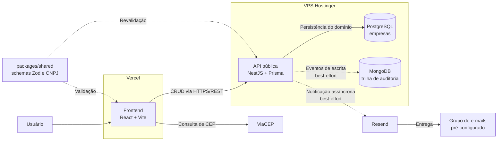

# Cadastro de Empresas — Teste Técnico KPMG

[](https://github.com/Arthur-Queiroz/kpmg-teste-tecnico/actions/workflows/ci.yml)

Aplicação full-stack de cadastro de empresas (CRUD completo, validação de
CNPJ com dígito verificador, endereço estruturado, autofill de CEP via
ViaCEP e notificação por e-mail a cada novo cadastro). Sem autenticação,
por exigência do desafio — todos os endpoints são públicos
([restrições do projeto](docs/CONSTRAINTS.md)).

## Funcionalidades

- Cadastro, listagem paginada, edição e exclusão de empresas.
- Busca por nome, nome fantasia ou CNPJ e filtro por estado.
- Validação compartilhada entre frontend e backend com Zod.
- Consulta direta ao ViaCEP para preenchimento do endereço.
- Notificação por e-mail ao cadastrar uma empresa.
- Trilha de auditoria para operações de criação, atualização e exclusão.
- API pública documentada com Swagger, sem autenticação por requisito.

## Produção

- **Frontend**: https://kpmg-test-frontend.vercel.app (Vercel)
- **Backend**: https://kpmg.devarthur.com.br (VPS Hostinger, Docker)
- **Swagger**: https://kpmg.devarthur.com.br/docs
- **Health**: https://kpmg.devarthur.com.br/health
- **Trilha de auditoria**: https://kpmg.devarthur.com.br/audit-logs

Como acompanhar os logs da aplicação em produção:
[guia de deployment, seção &#34;Observabilidade&#34;](docs/08-DEPLOYMENT.md#observabilidade-onde-ficam-os-logs).

## Stack

- **Backend**: NestJS 11 + Prisma 6 + PostgreSQL 16 + Zod
  (`nestjs-zod`) + Resend (e-mail).
- **Persistência poliglota**: PostgreSQL para o domínio (dados
  estruturados, CNPJ único, filtros combinados) e MongoDB para a trilha
  de auditoria (eventos append-only, de esquema variável) — o porquê
  está em `docs/09-DECISIONS.md`.
- **Frontend**: React 19 + Vite + Tailwind 4 + React Router +
  React Hook Form.
- **Compartilhado**: `packages/shared` — schemas Zod e validador de CNPJ
  usados por backend e frontend (única fonte de verdade de validação).
- **Monorepo**: pnpm workspaces (`apps/api`, `apps/web`,
  `packages/shared`).

## Arquitetura



No cadastro, a API persiste a empresa no PostgreSQL e responde `201` sem
esperar a entrega do e-mail. A notificação é enviada de forma assíncrona pelo
Resend; uma falha no provedor é registrada nos logs, mas não desfaz o cadastro.
As escritas do CRUD também geram eventos no MongoDB sem torná-lo dependência
crítica do domínio. O fluxo completo está em
[Arquitetura](docs/04-ARCHITECTURE.md) e as decisões estão em
[Decisões técnicas](docs/09-DECISIONS.md).

## Setup local

Pré-requisitos: Node 24, pnpm 10, Docker.

```bash
pnpm install
docker compose up -d                      # Postgres (5433) e MongoDB (27017)

cp apps/api/.env.example apps/api/.env    # valores de dev já preenchidos
pnpm --filter @kpmg/shared build          # a api consome o dist/ do shared
pnpm --filter api exec prisma migrate dev      # cria a tabela companies

pnpm --filter api dev                     # backend em localhost:3000 (Swagger em /docs)
pnpm --filter web dev                     # frontend em localhost:5173
```

Sem `RESEND_API_KEY`, o backend local continua funcional e apenas registra que
o envio foi ignorado. Para testar e-mails, preencha `RESEND_API_KEY` e
`NOTIFICATION_EMAILS` em `apps/api/.env`. As demais variáveis estão descritas
no [guia de deployment](docs/08-DEPLOYMENT.md#variáveis-de-ambiente).

## Testes

```bash
pnpm --filter @kpmg/shared test           # 17: validador de CNPJ + schemas Zod
pnpm --filter api test                    # 15 unitários (Company e AuditLog, mocks)
pnpm --filter api test:e2e                # 18 e2e (CRUD + prova sem auth + auditoria)
```

Os e2e rodam contra um Postgres real isolado (`kpmg_teste_test`, criado
pelo `docker/init-db.sql`; migrar antes com
`DATABASE_URL=...kpmg_teste_test pnpm --filter api exec prisma migrate deploy`).
Incluem a prova exigida pelo desafio de que o e-mail é disparado no
cadastro (via mock) e a prova deliberada de ausência de autenticação.

## CI/CD

Push/PR na `main` roda lint, typecheck, os 50 testes e build dos dois
apps. Merge na `main` dispara o release: build+push da imagem no GHCR
por digest e deploy na VPS via `deployctl` (modelo vps-infra), com
`prisma migrate deploy` rodando como job antes de cada swap do container.
O frontend deploya automaticamente pela integração nativa da Vercel.

## Documentação

Toda a documentação de planejamento, decisões e verificação está em
`docs/` — comece pelo [status atual](docs/status/README.md) e pelas
[decisões técnicas](docs/09-DECISIONS.md). O mapa completo está em
[AGENTS.md](AGENTS.md).
